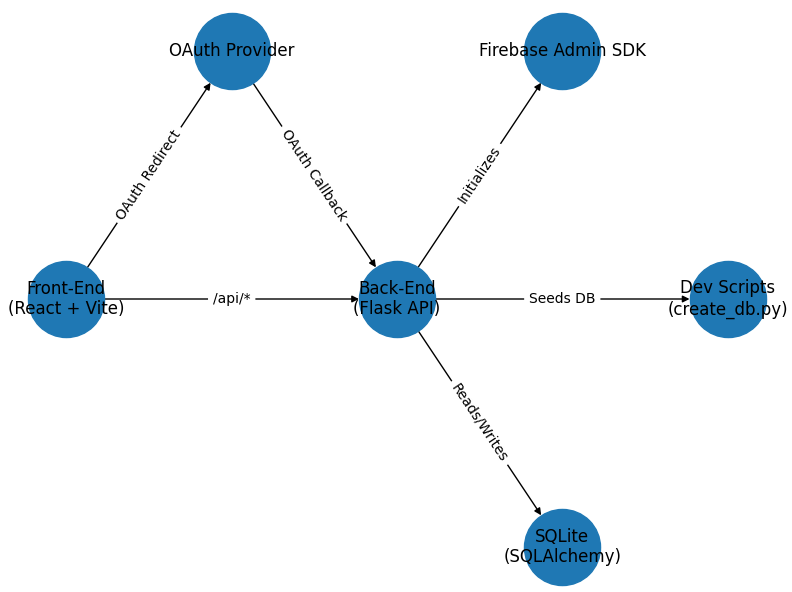

# redback-fit-backend

Backend for Redback Project 3 (Wearables for athletes), built with Python and Flask.

A modular Flask backend powering Reflexion Pro, an athlete wearables platform. It features:

* **OAuth authentication** via Authlib
* **Firebase Admin SDK** integration
* **SQLAlchemy + SQLite** with migrations
* **RESTful API** using Flask blueprints
* **Developer tooling** for rapid local setup

## Prerequisites
- [Git](https://git-scm.com/downloads) installed
- [Python 3.9+](https://www.python.org/downloads/) installed
- [Postman](https://www.postman.com/downloads/) installed (optional, for testing endpoints)

---

## Architecture Overview


 **Front-End** (React + Vite) interacts with the Flask API under `/api/*`.
* **Back-End** initializes Firebase Admin SDK, handles OAuth flows, and serves data from SQLite.
* **OAuth Provider** manages user authentication and tokens.
* **Firebase Admin SDK** grants admin-level access to Firebase services.
* **SQLite** stores core domain data via SQLAlchemy models and migrations.
* **Dev Scripts** (`create_db.py`) reset and seed the local development database.

---

## Directory Structure

```
redback-fit-backend/
├── manage.py            # Application entrypoint
├── requirements.txt     # Python packages
├── .env.example         # Environment variable template
├── config/              # Secure location for service-account JSON (ignored by Git)
├── app/                 # Application package
│   ├── __init__.py      # App factory
│   ├── config.py        # Environment-driven configuration
│   ├── extensions.py    # Initialize db, migrations, CORS, OAuth, Firebase
│   ├── models.py        # SQLAlchemy ORM models and seeders
│   ├── routes/          # Flask blueprints for API endpoints
│   └── services/        # External integrations (OAuth client setup)
├── migrations/          # Alembic migration scripts
├── scripts/             # Development utilities (create_db.py)
└── tests/               # pytest suites
```

### Getting Started
1. Clone the repository to your local machine  
    ```bash
    git clone https://github.com/Redback-Operations/redback-fit-backend.git
    ```

2. Navigate to the project directory  
    ```bash
    cd redback-fit-backend
    ```

3. Create a virtual environment  
    ```bash
    python -m venv env
    ```

4. Activate the virtual environment  
    - **Windows**  
        ```bash
        env\Scripts\activate
        ```
    - **Mac/Linux**  
        ```bash
        source env/bin/activate
        ```

5. Install required dependencies from `requirements.txt`  
    ```bash
    pip install -r requirements.txt
    ```

6. Configure environment variables**:

   ```bash
   cp .env.example .env
   ```

   Edit `.env` with:

   ```dotenv
   DATABASE_URL=sqlite:///redback.db
   GOOGLE_APPLICATION_CREDENTIALS=./config/serviceAccountKey.json
   FIREBASE_DATABASE_URL=https://<PROJECT-ID>.firebaseio.com
   OAUTH_CLIENT_ID=<your-client-id>
   OAUTH_CLIENT_SECRET=<your-client-secret>
   FRONTEND_URL=http://localhost:5173
   FLASK_RUN_HOST=127.0.0.1
   FLASK_RUN_PORT=5000
   ```
    >  **Generating `serviceAccountKey.json`:**
        > 1. Go to the Firebase Console at https://console.firebase.google.com  
        > 2. Select your project and click the ⚙️ **Project settings** button.  
        > 3. Switch to the **Service accounts** tab.  
        > 4. Under **Firebase Admin SDK**, click **Generate new private key**.  
        > 5. Download the JSON file and move it into your repo’s `config/` folder, naming it `serviceAccountKey.json`.  

7. Initialize the database and seed sample data:

   ```bash
   python scripts/create_db.py
   ```

8. Run the application**:

   ```bash
   python manage.py
   ```

   Access the API at [http://127.0.0.1:5000/api](http://127.0.0.1:5000/api)

---

## Contributing

1. Fork the repo and create a branch:

   ```bash
   git checkout -b feat/your-feature
   ```
2. Implement changes and add tests.
3. Commit and push:

   ```bash
   git add .
   git commit -m "feat: your feature description"
   git push origin feat/your-feature
   ```
4. Open a pull request against the main repository.

---